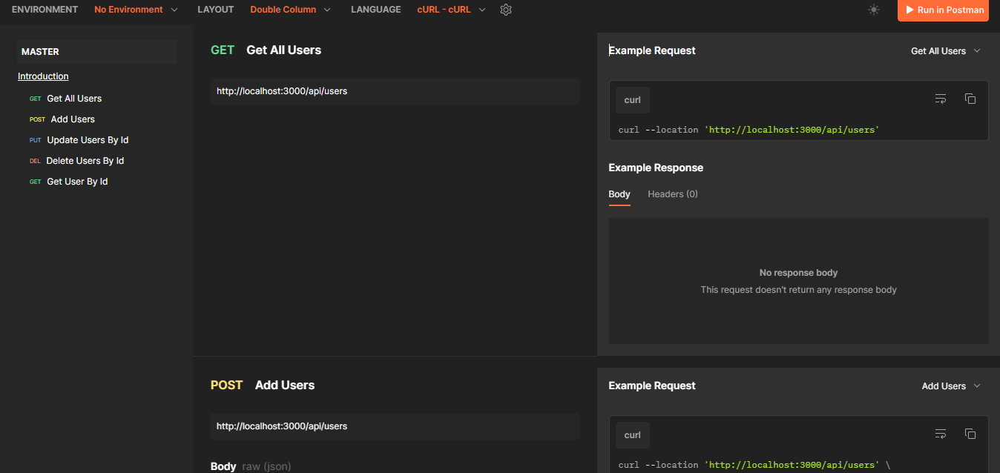

<p align="center">
  Master Project
</p>

<h1 align="center">
    <a href="https://git.io/typing-svg"></a>
</h1>

## Table of Contents

- [Introduction](#introduction)
- [Tech Stack](#Tech-Stack)
- [Features](#features)
- [Requirements](#requirements)
- [Postman Documentation](#Postman)
- [Release Demo](#Demo)
- [Related Project](#related-project-backend)
- [Developed](#Developed)
- [License](#License)
- [Contact](#Contact)


## Introduction

Master Project is a web application deployed in management of profiles that comes with capabilities for searching, adding, editing, and removing profiles if need be. At the moment, the dummy data is being used in the project to illustrate the practice work. The model can be regarded as a good basis for future advancements and linking to real data.


## Tech Stack

**Programming language:** JavaScript

**Library:** Node JS

**Framework:** Express JS

**Database:** PostgreSQL

**Tools:** Postman

[](https://skillicons.dev)


## Features

✨ Create Data Profile: Easily create new data profiles with complete and structured information.

✨ Update Data Profile: Update data profile especially Username & Email.

✨ Delete Data Profile: Quickly and securely delete data profiles, managing your information more efficiently.

✨ Search Data Profile: Find the data profile you need in seconds with our advanced search feature.


## Requirements

- [`npm`](https://www.npmjs.com/get-npm)
- [`postman`](https://www.postman.com/api-documentation-tool/)
- [`Express`](https://expressjs.com/en/starter/installing.html)
- [`NodeJS`](https://nodejs.org/docs/latest/api/)
- [`PostgreSQL`](https://www.postgresql.org/docs/)
- [`Frontend Master Project`](https://github.com/crossxjonathan/master-fe)


#### Clone this repository

```bash
   git clone https://github.com/crossxjonathan/master-be.git
```

#### Install Depedencies

```bash
   npm install
```

#### Start Project

```bash
   npm run dev
```


## Create Environment Variable

If you want to run this environment, you need to add the following environment variables to your .env file

setup server: 

Backend :
`DB_USERNAME`
`DB_PASSWORD`
`DB_HOST`
`DB_DATABASE`
`DB_PORT`


## Related Project (Frontend)

- [`Frontend Master Project`](https://github.com/crossxjonathan/master-fe)

## Postman
- [`Postman`](https://documenter.getpostman.com/view/30172936/2sAYBRFtpr)



## Developed :
💻 [@crossxjonathan](https://github.com/crossxjonathan/) as FullStack

## License :

-This project is licensed under the MIT License. Please refer to the [LICENSE](./LICENSE) file for further details

## Contact :
📧 firman.jonathan6398@gmail.com
🔗 https://www.linkedin.com/in/firman-jonathan/